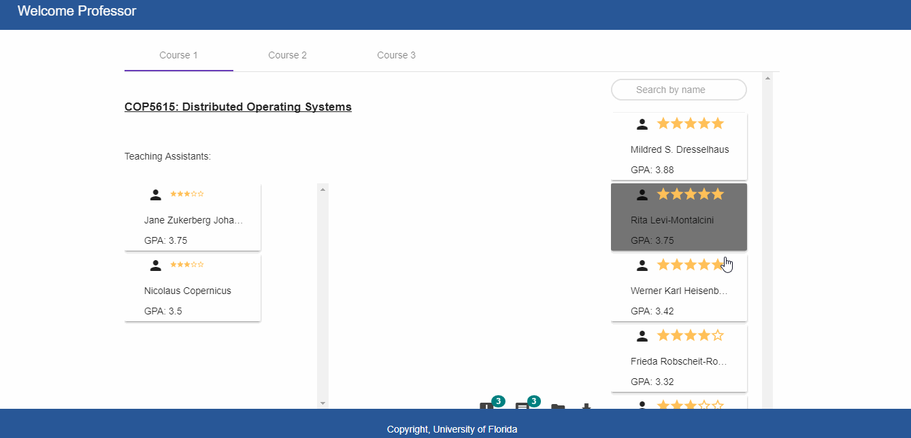

# TA-Management System

## Functionality

1) When a Professor logins:  
   -- Different tabs will be there for different courses.  
   -- For each course the professor will see the list of students available for him to choose as TAs.  
   -- The students list will be in sorted order according to their star ratings which is based on their GPA, interest etc.   
   -- The professor can drag, drop and remove the students he wants as TAs.  
   -- The professor can also see the latest announcements as wells as message his TAs.  
2) When a Student logins:  
   -- A student that has been selected as a TA can manage his profile here.  
   -- The student can update and upload his resume.  
   -- The student can upload his profile image, GPA etc.  
   -- The student can also see messages and announcements.  
3) When a TAManager logins:  
   -- There will be different cards for different courses.  
   -- For each course the manager can see what all students has the professor chosen for being the TA.  
   -- The manager can approve or reject the students for the TA position.

# TA-Management 

**TA Management** is a Application which can be used by Professor - to add and remove new TAs, Manager - to approve or reject TAs added by the Professor, and Student TA - to manage his Profile and get Notifications.

## Initial Setup

 Run following:

1. Download mongodb.
2. Configure db path. Run "mongod --dbpath /your/db/directory" from terminal.
3. Run "npm test". This will add initial values in db.
4. Run "npm install".
5. Open terminal. Run "npm start".
6. Open another terminal. Run "ng build --w".
7. Go to browser & check "localhost:3000".

## Running tests

### Back end testing    
    
1. Run unit test cases for backend   
    
    Follow the steps in order to test backend
    1. npm install
    2. npm test

### Front end testing
1.  Run unit test cases and show result in browser
    
    ng test 

2. Run existing test cases and calculate th code coverage. To see code coverage run the following command and then check coverage/index.html file

    ng test --cc 
    
### End to End Testing
1. Run e2e tests with the help of following steps. Execute these steps sequentially.
    1. npm install
    2. npm test
    3. npm start
    4. ng build --w
    5. ng e2e --no-serve
    

## User Stories

The following **required** functionality is completed:

## Generic
- [x] Professor should be able to login.
- [x] Student should be able to login.
- [x] Manager Should be able to login.

## For Professor
- [x] Professor should be able to add and remove students as TAs for a particular course, added students should be disabled in the list.
- [x] Professor should be able to search a particular student from the list and add him as TA
- [x] If professor added a student in 1 course he/she should be disabled in other courses.
- [x] Professor should be able to view announcements and notifications.
- [x] Professor should be able to message TAs.
- [x] Student selected for TAs by the Professor should persist, when professor login back again, They should be there.
- [x] Professor Should be able to download selected TA info in form of an excel sheet.

### Video Walkthrough 

Here's a walkthrough of implemented user stories for Professor:

- Professor should be able to add and remove students as TAs for a particular course, added students should be disabled in the list

- Professor should be able to search a particular student from the list and add him as TA

- If professor added a student in 1 course he/she should be disabled in other courses.

- Professor should be able to view announcements and notifications.

- Professor should be able to message TAs.

- Student selected for TAs by the Professor should persist, when professor login back again, They should be there.

- Professor Should be able to download selected TA info in form of an excel sheet.

***
## For Student
- [x] Student should be able to view home and profile page, his gpa, courses he is taking and His latest resume.
- [x] Student should be able to change his Gpa.
- [x] Student should be able to update his profile picture.
- [x] Student should be able to upload his resume.
- [x] Student Should be able to view his announcements, notification and messages.

### Video Walkthrough 

Here's a walkthrough of implemented user stories for Student:

- Student should be able to view home and profile page, his gpa, courses he is taking and His latest resume

- Student should be able to change his Gpa.

- Student should be able to update his profile picture.

- Student should be able to upload his resume.

- Student Should be able to view his announcements, notification and messages.

***

## For Manager
- [x] Manager should be able to view all the courses and the TAs selected by the professors in those courses.
- [x] Manager should be able to approve or reject the TAs selected by the Professor.
- [x] Manager should be able to search a student from the list of students who applied for TA and Approve or reject student's request.
- [x] Manager should be able to view announcements and notifications.

### Video Walkthrough 

Here's a walkthrough of implemented user stories for Manager:

- Manager should be able to view all the courses and the TAs selected by the professors in those courses.

- Manager should be able to approve or reject the TAs selected by the Professor.

- Manager should be able to search a student from the list of students who applied for TA and Approve or reject student's request.

- Manager should be able to view announcements and notifications.

***

## Notes

Describe any challenges encountered while building the app.

## License

    Copyright [2017] [University Of Florida]

    Licensed under the Apache License, Version 2.0 (the "License");
    you may not use this file except in compliance with the License.
    You may obtain a copy of the License at

        http://www.apache.org/licenses/LICENSE-2.0

    Unless required by applicable law or agreed to in writing, software
    distributed under the License is distributed on an "AS IS" BASIS,
    WITHOUT WARRANTIES OR CONDITIONS OF ANY KIND, either express or implied.
    See the License for the specific language governing permissions and
    limitations under the License.
